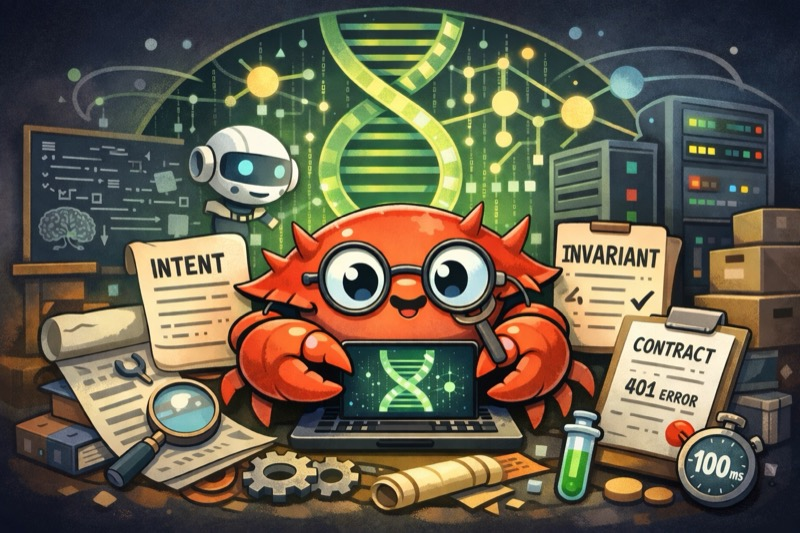

<div align="center">

# DNA



[](https://github.com/panbanda/dna/releases/latest)
[](https://github.com/panbanda/dna/actions)
[](https://opensource.org/licenses/MIT)

**The genetic code of your software.**

DNA is a CLI for capturing the essential identity of your system - the decisions, constraints, and guarantees that define what it *is*, independent of how it's currently implemented. Like biological DNA, these truth artifacts persist while everything around them changes: frameworks evolve, teams turn over, code gets rewritten. The blueprint survives.

</div>

---

## Why DNA?

### The Problem

Software systems fail not because code is wrong, but because **meaning drifts**.

Every codebase accumulates decisions. Why was this approach chosen? What constraints are load-bearing? Which behaviors are guaranteed? This knowledge erodes through:

- Commit messages that explain "what" but not "why"
- Documentation that describes the system as it was, not as it must remain
- Tribal knowledge that walks out the door with departing team members
- AI-generated code with no memory of the intent it was meant to serve

The result: systems where changing anything feels dangerous because no one knows what's actually important.

### The Solution: Encode the Identity

Your system has a genetic code - the core decisions and constraints that make it what it is. The problem is that this code is scattered across commit messages, Slack threads, and the minds of people who've moved on.

DNA makes it explicit. It captures the **truth artifacts** that define your system's identity - not as documentation that rots, but as first-class, searchable, persistent records that survive refactors, rewrites, and team turnover.

Think of it this way: code is the phenotype (what you can observe). DNA captures the genotype (why it's that way):

```bash
# Declare an intent (the "why")
dna intent add "Authentication must support both OAuth and API keys to serve web and programmatic users"

# Define an invariant (what must always be true)
dna invariant add "User passwords must be hashed with bcrypt cost factor >= 12"

# Specify a contract (guaranteed behavior)
dna contract add "POST /api/auth returns 401 for invalid credentials within 100ms"
```

Later, when you (or an AI agent) asks "Why do we support multiple auth methods?":

```bash
dna search "authentication methods"
# Instantly finds the intent artifact with full context
```

## Key Features

- **7 Artifact Types**: intent, invariant, contract, algorithm, evaluation, pace, monitor
- **Semantic Search**: Vector-powered search finds artifacts by meaning, not keywords
- **Flexible Embedding**: Local (Candle), OpenAI, or Ollama providers
- **MCP Integration**: Native Model Context Protocol server for AI agents
- **Project-Scoped**: Each project is independent, no global configuration
- **Cross-Platform**: Linux, macOS, Windows support with native binaries

## The DNA Approach

Every living system has two layers: the genetic code that defines what it is, and the physical expression of that code. Software works the same way - but we've been ignoring the genetic layer.

### The Core Insight

Code is not your system. Code is just the current expression of your system.

The actual system - its purpose, its constraints, its promises - exists at a deeper level. That's what DNA captures: the genotype that persists while the phenotype (code) evolves.

When you encode this identity as first-class artifacts:
- Implementations become disposable. Rewrite with confidence because you know what must be preserved.
- AI agents can generate code that respects constraints they didn't create.
- New team members understand not just *what* the system does, but *why*.
- The system's identity survives the people who shaped it.

### The Seven Artifact Types

DNA provides seven artifact types - think of them as different genes that encode different aspects of your system's identity. Each captures a distinct kind of truth.

#### Intent

**What the system is for.**

Intents capture the normative "why" behind features and capabilities. They're not user stories or requirements - they're statements of purpose that explain what value the system provides and to whom.

```bash
dna intent add "Support real-time collaboration to enable distributed teams to work together without friction"
```

An intent answers: *Why does this exist? What problem does it solve? Who benefits?*

When an intent no longer reflects reality, that's not a documentation bug - it's an identity crisis that demands explicit resolution.

#### Invariant

**What must always be true.**

Invariants are the load-bearing walls of your system. They define properties that cannot be violated without fundamentally breaking the system's guarantees. Every invariant is a line in the sand.

```bash
dna invariant add "User passwords are never stored in plaintext or reversible encryption"
```

Invariants are not aspirational. If something is an invariant, violating it - even temporarily, even in tests - is a system failure. If you find yourself wanting to "temporarily" break an invariant, you've misclassified it.

#### Contract

**What behavior is guaranteed.**

Contracts define the promises your system makes to its consumers - whether those are users, APIs, or other services. They specify observable behavior that callers can depend on.

```bash
dna contract add "POST /api/auth returns 401 for invalid credentials, never 500"
```

A contract violation is a breaking change, regardless of what your versioning says. Contracts force you to be explicit about what's guaranteed versus what's incidental.

#### Algorithm

**How critical operations work.**

Algorithms capture the specific approaches used for operations where the method matters. These aren't implementation details - they're deliberate choices with security, performance, or correctness implications.

```bash
dna algorithm add "Password hashing uses bcrypt with cost factor >= 12"
```

Algorithms answer: *Why this approach and not another? What properties does it guarantee?* They prevent well-meaning refactors from accidentally downgrading security or correctness.

#### Evaluation

**How success is measured.**

Evaluations define the authoritative criteria for determining whether the system is acceptable. They're not metrics dashboards - they're the specific thresholds that separate "working" from "broken."

```bash
dna evaluation add "Search results return in <100ms at p95 under normal load"
```

When an evaluation fails, the system is unacceptable - regardless of whether all tests pass or the code looks correct. Evaluations outrank opinions.

#### Pace

**How fast things can change.**

Pace artifacts define the velocity constraints for different parts of the system. Some things can change freely. Others require ceremony. Some should change rarely and deliberately.

```bash
dna pace add "Schema migrations require review from database team and 48-hour staging validation"
```

Pace is about permission, not guidance. It answers: *Who can change this? How fast? With what oversight?* It prevents the slow erosion of critical guarantees through incremental "improvements."

#### Monitor

**What must be observable.**

Monitors define the observability requirements - what events must be captured, what metrics must be tracked, what visibility is non-negotiable for operating the system.

```bash
dna monitor add "All authentication attempts logged with timestamp, IP, and outcome"
```

Monitors aren't logging best practices. They're the specific observability guarantees that operators can depend on for debugging, security, and compliance.

## Real-World Use Cases

### For Solo Developers

Your future self is a stranger who inherits your codebase with zero context.

DNA lets you leave behind not just code, but the reasoning that shaped it. When you return to a project after months away, semantic search surfaces the decisions that matter - why the authentication works this way, what performance constraints drove the architecture, which simplifications would break things.

### For Teams

New team members don't need to absorb years of context through osmosis.

DNA makes the essential knowledge explicit and discoverable. Onboarding becomes: "Search for intents related to what you're building. Read the invariants before you touch anything. Understand the contracts before you change APIs." The knowledge that used to live in senior engineers' heads becomes institutional memory that scales.

### For AI-Human Collaboration

AI agents are powerful executors, but they lack judgment about what matters.

DNA gives them guardrails. When an agent has access to your truth artifacts, it can generate code that respects invariants it didn't create, honor contracts it wasn't told about, and understand intent it couldn't infer from code alone. The agent becomes a collaborator that operates within boundaries you've defined.

### For Long-Lived Systems

Most software lives longer than any individual's tenure on the team.

DNA captures the decisions that must survive personnel changes, framework migrations, and architectural evolution. When you need to rewrite a service, the truth artifacts tell you what must be preserved. The implementation is disposable; the identity persists.

## Installation

### Homebrew (Recommended)

```bash
brew install panbanda/dna/dna
```

### Pre-built Binaries

Download the latest release for your platform:

```bash
# Linux x86_64
curl -LO https://github.com/panbanda/dna/releases/latest/download/dna-linux-x86_64.tar.gz
tar xzf dna-linux-x86_64.tar.gz
sudo mv dna /usr/local/bin/

# macOS (Apple Silicon)
curl -LO https://github.com/panbanda/dna/releases/latest/download/dna-macos-aarch64.tar.gz
tar xzf dna-macos-aarch64.tar.gz
sudo mv dna /usr/local/bin/

# Windows (download and add to PATH)
# https://github.com/panbanda/dna/releases/latest/download/dna-windows-x86_64.zip
```

### From Source

```bash
git clone https://github.com/panbanda/dna.git
cd dna
cargo build --release
```

## Quick Start

### 1. Initialize Your Project

```bash
dna init
# Creates .dna/ directory with config and vector database
```

### 2. Add Artifacts

```bash
# Why does this feature exist?
dna intent add "Support real-time collaboration to enable distributed teams" --meta feature=collaboration

# What must always be true?
dna invariant add "Document versions are immutable once published" --meta domain=document-model

# What behavior is guaranteed?
dna contract add "GET /api/documents/{id} returns 404 if document doesn't exist" --meta api=documents
```

### 3. Search Semantically

```bash
# Find by meaning, not exact keywords
dna search "team working together"
# Finds: "Support real-time collaboration..."

dna search "document can't change"
# Finds: "Document versions are immutable..."
```

### 4. Organize and Render

```bash
# Group artifacts by metadata
dna render --by domain
# Creates: artifacts/domain/document-model/invariants/...

# Export as markdown
dna render --format markdown
```

## MCP Server for AI Agents

DNA includes a Model Context Protocol (MCP) server that lets AI agents interact with artifacts:

### Setup

Add to your Claude Code or other MCP-compatible client:

```json
{
  "mcpServers": {
    "dna": {
      "command": "dna",
      "args": ["mcp", "stdio"],
      "cwd": "/path/to/your/project"
    }
  }
}
```

### Available Tools

- `list_artifacts`: List all artifacts by type
- `search_artifacts`: Semantic search across all artifacts
- `get_artifact`: Retrieve specific artifact details
- `add_artifact`: Create new artifacts
- `update_artifact`: Modify existing artifacts
- `delete_artifact`: Remove artifacts

### Tool Filtering

Enable only specific tools for focused agents:

```bash
dna mcp stdio --include-tools list_artifacts,search_artifacts
# Read-only mode for safety
```

## Configuration

### Changing the Embedding Model

DNA supports multiple embedding providers. Configure in `.dna/config.toml`:

**Local (Default - No Setup Required)**
```toml
[model]
provider = "local"
name = "BAAI/bge-small-en-v1.5"
```

**OpenAI**
```toml
[model]
provider = "openai"
name = "text-embedding-3-small"  # or "text-embedding-3-large" for higher quality
api_key = "sk-..."  # Or set OPENAI_API_KEY environment variable
```

**Ollama (Local with GPU Acceleration)**
```toml
[model]
provider = "ollama"
name = "nomic-embed-text"  # or "mxbai-embed-large", "all-minilm"
base_url = "http://localhost:11434"
```

### Embedding Provider Comparison

| Provider | Best For | Setup | Notes |
|----------|----------|-------|-------|
| **Local (Candle)** | Privacy, offline use | None | Uses `BAAI/bge-small-en-v1.5` by default |
| **OpenAI** | Best quality, production | API key | `text-embedding-3-small` or `text-embedding-3-large` |
| **Ollama** | Local + GPU acceleration | [Install Ollama](https://ollama.ai) | Run `ollama pull nomic-embed-text` first |

After changing providers, re-index existing artifacts:
```bash
dna reindex
```

## Development

### Building from Source

```bash
git clone https://github.com/panbanda/dna.git
cd dna
cargo build --release
```

### Running Tests

```bash
# Run all tests
cargo test

# Run with coverage
cargo llvm-cov --all-features
```

### Contributing

We welcome contributions! Please see [CONTRIBUTING.md](CONTRIBUTING.md) for guidelines.

**Development Requirements**:
- Rust 1.88+
- Pre-commit hooks: `lefthook install`
- 65% code coverage for new code
- All clippy lints must pass

### Code Quality

DNA enforces strict quality standards:
- **Formatting**: rustfmt
- **Linting**: clippy (strict mode)
- **Testing**: 65% minimum coverage
- **Security**: cargo-audit, cargo-deny
- **Documentation**: All public APIs documented

## Project Status

DNA is under active development. Current status:

- [x] Core artifact management
- [x] Vector search with LanceDB
- [x] MCP server integration
- [x] Local embedding support
- [x] OpenAI/Ollama providers
- [x] File rendering
- [ ] Web interface (planned)

## Performance

- **Search**: <50ms for 10k artifacts (p95)
- **Embedding**: 100-500 tokens/sec (local)
- **Storage**: ~1KB per artifact (compressed)
- **Memory**: <100MB for typical projects

## License

MIT License - see [LICENSE](LICENSE) for details.

## Acknowledgments

- Methodology inspired by [Intent-Starter](https://github.com/billeisenhauer/intent-starter) and its [Manifesto](https://github.com/billeisenhauer/intent-starter/blob/main/MANIFESTO.md) by Bill Eisenhauer
- Philosophy influenced by Martin Fowler's [Phoenix Server](https://martinfowler.com/bliki/PhoenixServer.html) and [Immutable Server](https://martinfowler.com/bliki/ImmutableServer.html) patterns
- Built with [LanceDB](https://lancedb.com/) for vector storage
- Embeddings via [Candle](https://github.com/huggingface/candle)
- Integrates with [Model Context Protocol](https://modelcontextprotocol.io/)

## Support

- **Documentation**: [docs/](docs/)
- **Issues**: [GitHub Issues](https://github.com/panbanda/dna/issues)
- **Discussions**: [GitHub Discussions](https://github.com/panbanda/dna/discussions)

---

**Encode what matters. Let the rest evolve.**
