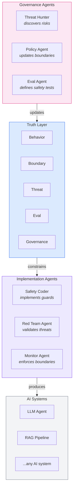

<div align="center">

# DNA


[](https://github.com/panbanda/dna/releases/latest)
[](https://github.com/panbanda/dna/actions)
[](https://opensource.org/licenses/MIT)

**The genetic code of your software.**

Capture the essential identity of your system - decisions, constraints, and guarantees that define what it *is*, independent of implementation. Truth artifacts persist while frameworks evolve, teams change, and code gets rewritten.

[Documentation](https://panbanda.github.io/dna) | [Installation](#installation) | [Quick Start](#quick-start)

</div>

---

## Installation

```bash
# Homebrew (macOS/Linux)
brew install panbanda/dna/dna

# Or download binary from releases
curl -LO https://github.com/panbanda/dna/releases/latest/download/dna-$(uname -s | tr '[:upper:]' '[:lower:]')-$(uname -m).tar.gz
tar xzf dna-*.tar.gz && sudo mv dna /usr/local/bin/
```

## Quick Start

```bash
# Initialize with a template
dna init --template intent

# Add truth artifacts
dna add intent "Orders must not ship until payment confirmed"
dna add contract "POST /orders returns 201 with order_id"
dna add constraint "API response time < 500ms at p95"

# Search by meaning
dna search "payment requirements"

# List artifacts
dna list --kind intent
```

## Templates

DNA provides predefined templates for common use cases:

| Template | Use Case | Kinds |
|----------|----------|-------|
| `intent` | Software systems | 11 kinds: intent, contract, algorithm, evaluation, pace, monitor, glossary, integration, reporting, compliance, constraint |
| `ai-safety` | AI/LLM systems | 5 kinds: behavior, boundary, threat, eval, governance |

### Intent Template

Truth artifacts that constrain implementations across any language or framework:

```mermaid
flowchart TB
    subgraph discovery["Discovery Agents"]
        architect["Architect Agent<br/><i>discovers intent</i>"]
        analyst["Analyst Agent<br/><i>extracts contracts</i>"]
        auditor["Compliance Agent<br/><i>updates regulations</i>"]
    end

    subgraph truth["Truth Layer"]
        intent["Intent"]
        contract["Contract"]
        algorithm["Algorithm"]
        evaluation["Evaluation"]
        constraint["Constraint"]
        pace["Pace"]
        monitor["Monitor"]
        glossary["Glossary"]
        integration["Integration"]
        reporting["Reporting"]
        compliance["Compliance"]
    end

    subgraph coding["Coding Agents"]
        coder["Coder Agent<br/><i>implements features</i>"]
        tester["Test Agent<br/><i>validates evals</i>"]
        reviewer["Review Agent<br/><i>checks constraints</i>"]
    end

    subgraph impl["Implementations"]
        impl1["Go App"]
        impl2["Python App"]
        impl3["...any language"]
    end

    discovery -->|"updates"| truth
    truth -->|"constrains"| coding
    coding -->|"produces"| impl

    style discovery fill:#d1fae5,stroke:#059669
    style truth fill:#fef3c7,stroke:#d97706
    style coding fill:#ede9fe,stroke:#7c3aed
    style impl fill:#f3f4f6,stroke:#6b7280
```



### AI Safety Template

Truth artifacts for AI/LLM system safety and governance:



```bash
# List available templates
dna init --list-templates

# Initialize with AI safety template
dna init --template ai-safety
```

See [docs/templates/](docs/templates/) for detailed documentation on each template.

## MCP Integration

DNA works with AI agents via Model Context Protocol:

```json
{
  "mcpServers": {
    "dna": {
      "command": "dna",
      "args": ["mcp", "stdio"]
    }
  }
}
```

## Configuration

Configure embedding providers in `.dna/config.toml`:

```toml
# Local (default, no setup required)
[model]
provider = "local"
name = "BAAI/bge-small-en-v1.5"

# OpenAI
[model]
provider = "openai"
name = "text-embedding-3-small"
api_key = "sk-..."

# Ollama
[model]
provider = "ollama"
name = "nomic-embed-text"
base_url = "http://localhost:11434"
```

## Development

```bash
git clone https://github.com/panbanda/dna.git
cd dna
cargo build --release
cargo test
```

## License

MIT - see [LICENSE](LICENSE)

## Links

- [Full Documentation](https://panbanda.github.io/dna)
- [Template Reference](docs/templates/)
- [GitHub Issues](https://github.com/panbanda/dna/issues)
- [Changelog](CHANGELOG.md)

---

*Methodology inspired by [Intent-Starter](https://github.com/billeisenhauer/intent-starter) by Bill Eisenhauer*
